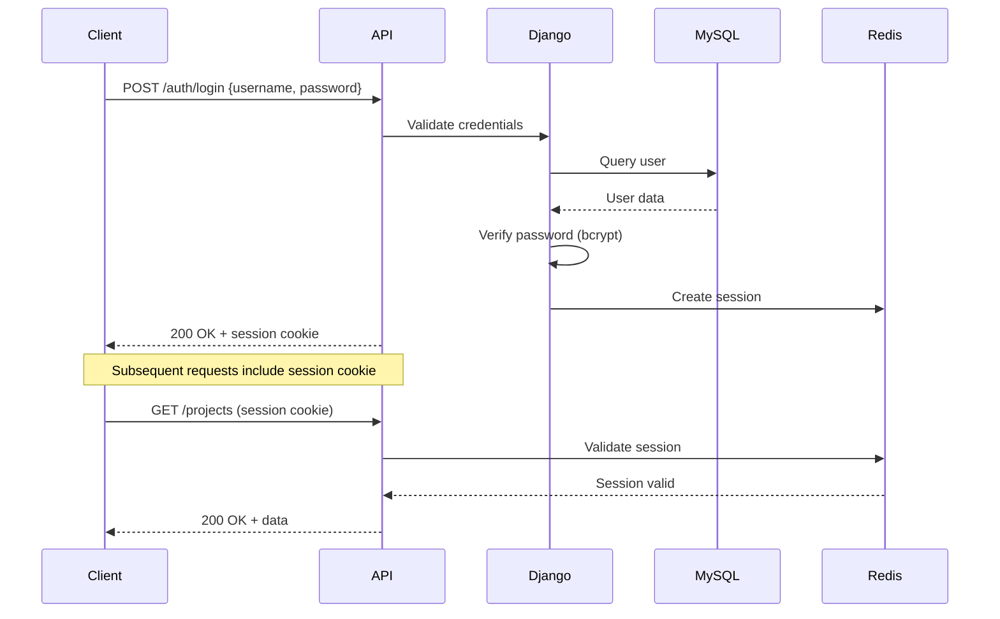

# API Documentation

**Version:** 2.0  
**Date:** February 2, 2026  
**Base URL:** `http://localhost:8000/api/v1/`  

---

## Table of Contents

1. [API Overview](#1-api-overview)
2. [Authentication Flow](#2-authentication-flow)
3. [Authentication Endpoints](#3-authentication-endpoints)
4. [Projects Endpoints](#4-projects-endpoints)
5. [Geospatial Endpoints](#5-geospatial-endpoints)
6. [Import/Export Endpoints](#6-importexport-endpoints)
7. [Reports Endpoints](#7-reports-endpoints)
8. [Reference Data Endpoints](#8-reference-data-endpoints)
9. [User Management Endpoints](#9-user-management-endpoints)
10. [Audit Log Endpoints](#10-audit-log-endpoints)
11. [Notification Endpoints](#11-notification-endpoints)
12. [WebSocket Events](#12-websocket-events)
13. [Error Responses](#13-error-responses)
14. [Pagination](#14-pagination)
15. [Filtering](#15-filtering)
16. [Rate Limiting](#16-rate-limiting)

---

## 1. API Overview

### 1.1 Response Format

All API responses follow this structure:

**Success Response:**
```json
{
  "success": true,
  "data": { ... }
}
```

**Error Response:**
```json
{
  "success": false,
  "error": "Error message",
  "details": { ... }
}
```

### 1.2 Authentication

All endpoints (except `/auth/login`) require session-based authentication.

**Session Cookie:** `sessionid` (httpOnly, secure)

### 1.3 Status Codes

| Code | Description |
|------|-------------|
| 200 OK | Request successful |
| 201 Created | Resource created successfully |
| 204 No Content | Successful, no content returned |
| 400 Bad Request | Invalid request data |
| 401 Unauthorized | Not authenticated |
| 403 Forbidden | Insufficient permissions |
| 404 Not Found | Resource not found |
| 422 Validation Error | Data validation failed |
| 429 Too Many Requests | Rate limit exceeded |
| 500 Internal Server Error | Server error |

---

## 2. Authentication Flow



---

## 3. Authentication Endpoints

### POST /auth/login

Login user with credentials.

**Request:**
```json
{
  "username": "admin",
  "password": "password123"
}
```

**Response (200):**
```json
{
  "success": true,
  "data": {
    "id": 1,
    "username": "admin",
    "email": "admin@example.com",
    "full_name": "Administrator",
    "role": "Admin"
  }
}
```

**Error (401):**
```json
{
  "success": false,
  "error": "Invalid username or password"
}
```

### POST /auth/logout

Logout current user.

**Response (200):**
```json
{
  "success": true,
  "message": "Logged out successfully"
}
```

### GET /auth/me

Get current user details.

**Response (200):**
```json
{
  "success": true,
  "data": {
    "id": 1,
    "username": "admin",
    "email": "admin@example.com",
    "full_name": "Administrator",
    "role": "Admin",
    "is_active": true,
    "last_login": "2024-02-01T10:00:00Z"
  }
}
```

**Error (401):**
```json
{
  "success": false,
  "error": "Not authenticated"
}
```

---

## 4. Projects Endpoints

### GET /projects/

List projects with optional filters.

**Query Parameters:**
- `page` (int, default=1): Page number
- `page_size` (int, default=50): Items per page
- `project_type` (int, optional): Filter by project type ID
- `status` (str, optional): Filter by status
- `province` (int, optional): Filter by province ID
- `municipality` (int, optional): Filter by municipality ID
- `barangay` (int, optional): Filter by barangay ID
- `search` (str, optional): Search in site_code or site_name
- `date_from` (date, optional): Activation date from
- `date_to` (date, optional): Activation date to

**Request Example:**
```
GET /api/v1/projects/?page=1&page_size=20&status=In Progress&province=1
```

**Response (200):**
```json
{
  "success": true,
  "data": {
    "count": 150,
    "next": "http://localhost:8000/api/v1/projects/?page=2",
    "previous": null,
    "results": [
      {
        "id": 1,
        "site_code": "UNDP-GI-0009A",
        "site_name": "Raele Barangay Hall - AP 1",
        "project_type": {
          "id": 1,
          "name": "Free-WIFI for All",
          "color_code": "#28a745"
        },
        "status": "In Progress",
        "activation_date": "2024-01-15",
        "location": {
          "latitude": 20.728794,
          "longitude": 121.804235
        },
        "barangay": "Raele",
        "municipality": "Itbayat",
        "province": "Batanes",
        "district": "District I",
        "created_at": "2024-01-10T08:00:00Z",
        "updated_at": "2024-01-15T10:30:00Z"
      }
    ]
  }
}
```

### GET /projects/{id}/

Get single project details.

**Request:**
```
GET /api/v1/projects/1/
```

**Response (200):**
```json
{
  "success": true,
  "data": {
    "id": 1,
    "site_code": "UNDP-GI-0009A",
    "site_name": "Raele Barangay Hall - AP 1",
    "project_type": {
      "id": 1,
      "name": "Free-WIFI for All",
      "code_prefix": "UNDP",
      "color_code": "#28a745"
    },
    "status": "In Progress",
    "activation_date": "2024-01-15",
    "remarks": "Installation pending equipment delivery",
    "location": {
      "latitude": 20.728794,
      "longitude": 121.804235
    },
    "barangay": "Raele",
    "municipality": "Itbayat",
    "province": "Batanes",
    "district": "District I",
    "created_by": "Administrator",
    "updated_by": "John Doe",
    "created_at": "2024-01-10T08:00:00Z",
    "updated_at": "2024-01-15T10:30:00Z"
  }
}
```

**Error (404):**
```json
{
  "success": false,
  "error": "Project not found"
}
```

### POST /projects/

Create new project. Requires Editor, Manager, or Admin role.

**Request:**
```json
{
  "site_code": "UNDP-GI-0010A",
  "project_type": 1,
  "site_name": "Sample Barangay Hall - AP 1",
  "barangay": 1,
  "municipality": 1,
  "province": 1,
  "district": 1,
  "latitude": 20.730000,
  "longitude": 121.805000,
  "activation_date": "2024-02-01",
  "status": "Pending",
  "remarks": "Initial project"
}
```

**Response (201):**
```json
{
  "success": true,
  "data": {
    "id": 10,
    "site_code": "UNDP-GI-0010A",
    "site_name": "Sample Barangay Hall - AP 1",
    "status": "Pending",
    "created_at": "2024-02-01T08:00:00Z"
  }
}
```

**Error (422):**
```json
{
  "success": false,
  "error": {
    "site_code": ["Project with this site code already exists."],
    "latitude": ["This field is required."]
  }
}
```

### PUT /projects/{id}/

Update project. Requires Editor, Manager, or Admin role.

**Request:**
```json
{
  "site_name": "Updated Site Name",
  "status": "In Progress",
  "activation_date": "2024-02-15",
  "remarks": "Updated remarks"
}
```

**Response (200):**
```json
{
  "success": true,
  "data": {
    "id": 10,
    "site_name": "Updated Site Name",
    "status": "In Progress",
    "updated_at": "2024-02-01T10:30:00Z"
  }
}
```

### DELETE /projects/{id}/

Soft delete project. Requires Editor, Manager, or Admin role.

**Response (204):** No content

**Error (404):**
```json
{
  "success": false,
  "error": "Project not found"
}
```

### GET /projects/{id}/history/

Get status change history for a project.

**Response (200):**
```json
{
  "success": true,
  "data": [
    {
      "id": 1,
      "old_status": "Pending",
      "new_status": "In Progress",
      "reason": "Equipment delivered",
      "changed_by": "John Doe",
      "changed_at": "2024-02-15T10:00:00Z"
    }
  ]
}
```

---

## 5. Geospatial Endpoints

### GET /geo/map-data/

Get all projects as GeoJSON for map display.

**Query Parameters:**
- `project_type` (int, optional)
- `status` (str, optional)
- `province` (int, optional)

**Response (200):**
```json
{
