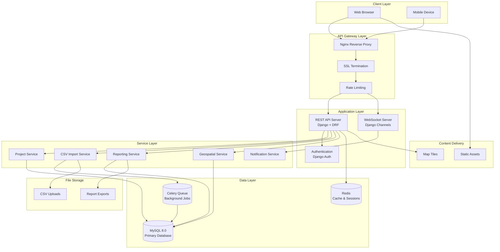
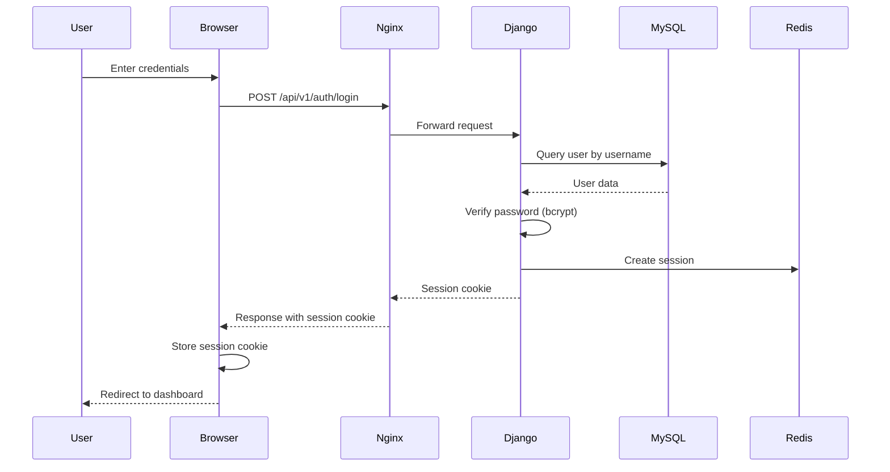
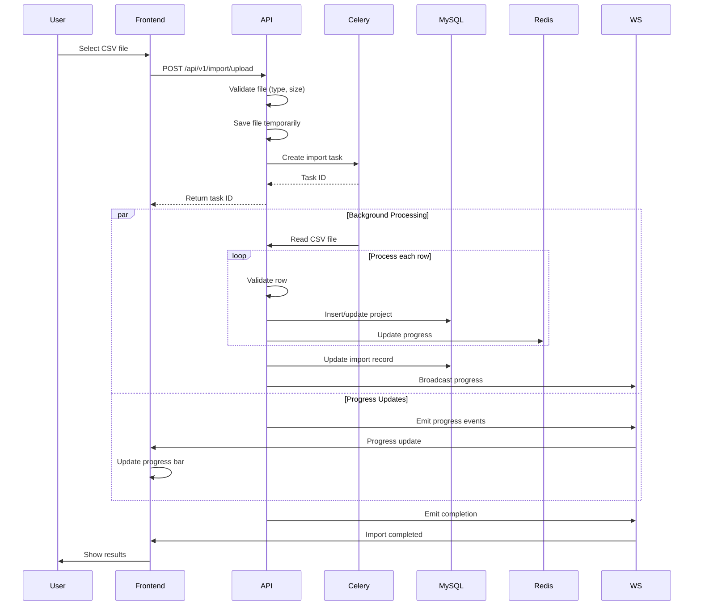

# System Architecture

**Version:** 2.0  
**Date:** February 2, 2026  

---

## Table of Contents

1. [High-Level Architecture](#1-high-level-architecture)
2. [Component Breakdown](#2-component-breakdown)
3. [Data Flow Diagrams](#3-data-flow-diagrams)
4. [Technology Stack Rationale](#4-technology-stack-rationale)
5. [Scalability Considerations](#5-scalability-considerations)
6. [Security Architecture](#6-security-architecture)

---

## 1. High-Level Architecture

### 1.1 System Architecture Diagram



### 1.2 Layer Descriptions

#### Client Layer
- **Web Browser**: Modern browsers (Chrome, Firefox, Safari, Edge) accessing the web application
- **Mobile Device**: Responsive design supports mobile/tablet access

#### CDN Layer
- **Static Assets**: Served via CDN for faster loading (images, fonts, CSS, JS)
- **Map Tiles**: Vector tile server for MapLibre GL JS

#### API Gateway Layer
- **Nginx**: Reverse proxy and load balancer
- **Rate Limiting**: Prevents API abuse
- **SSL Termination**: HTTPS/TLS encryption

#### Application Layer
- **REST API**: Django REST Framework endpoints
- **WebSocket**: Django Channels for real-time updates
- **Authentication**: Session-based auth with Django Auth

#### Service Layer
- **Business Logic**: Separated service classes for each domain
- **Reusability**: Shared services across multiple endpoints

#### Data Layer
- **MySQL**: Primary database with spatial extensions
- **Redis**: Caching, session storage, Celery broker
- **Celery Queue**: Background job processing

---

## 2. Component Breakdown

### 2.1 Backend Components

#### Django Apps Structure

```
backend/
├── config/              # Django project configuration
│   ├── settings/        # Environment-specific settings
│   ├── urls.py         # Root URL routing
│   ├── wsgi.py         # WSGI configuration
│   └── asgi.py         # ASGI configuration (Channels)
│
├── apps/                # Django apps (modular)
│   ├── accounts/        # User management
│   ├── locations/       # Location hierarchy
│   ├── projects/        # Project CRUD
│   ├── geo/            # Geospatial queries
│   ├── import_export/   # CSV import/export
│   ├── reports/         # Analytics & reporting
│   ├── notifications/   # WebSocket notifications
│   └── audit/           # Audit logging
│
└── core/                # Shared utilities
    ├── pagination.py
    ├── permissions.py
    ├── exceptions.py
    └── utils.py
```

#### Django Apps Descriptions

| App | Purpose | Key Components |
|-----|---------|---------------|
| **accounts** | User authentication and management | User model, login/logout, password reset |
| **locations** | Administrative hierarchy | Province, District, Municipality, Barangay models |
| **projects** | Project management | ProjectSite, ProjectType, StatusHistory models |
| **geo** | Geospatial queries | Spatial queries, GeoJSON endpoints |
| **import_export** | CSV processing | CSVImport model, Celery tasks |
| **reports** | Analytics | Statistics endpoints, chart data |
| **notifications** | Real-time updates | WebSocket consumers, Notification model |
| **audit** | Operation logging | AuditLog model, middleware |

### 2.2 Frontend Components

```
frontend/src/
├── components/          # React components
│   ├── ui/           # shadcn/ui components
│   ├── layout/        # Layout components
│   ├── auth/          # Auth components
│   ├── dashboard/     # Dashboard widgets
│   ├── map/          # Map components
│   ├── projects/      # Project components
│   ├── import/        # CSV import components
│   ├── reports/       # Report components
│   └── shared/        # Shared components
│
├── pages/              # Page components
│   ├── Dashboard.tsx
│   ├── MapView.tsx
│   ├── ProjectList.tsx
│   ├── ProjectDetail.tsx
│   ├── ImportPage.tsx
│   └── Reports.tsx
│
├── services/           # API layer
│   ├── api.ts
│   ├── auth.service.ts
│   ├── projects.service.ts
│   └── notifications.service.ts
│
├── stores/             # Zustand stores
│   ├── authStore.ts
│   ├── filterStore.ts
│   └── notificationStore.ts
│
├── hooks/              # Custom React hooks
│   ├── useAuth.ts
│   ├── useProjects.ts
│   └── useSocket.ts
│
└── types/              # TypeScript types
    └── index.ts
```

---

## 3. Data Flow Diagrams

### 3.1 Authentication Flow



### 3.2 CSV Import Flow



### 3.3 Real-time Update Flow

```mermaid
sequenceDiagram
    participant User1
    participant User2
    participant Django
    participant MySQL
    participant WebSocket
    participant Redis
    
    User1->>Django: Create/update project
    Django->>MySQL: Save project
    Django->>MySQL: Create audit log
    Django->>Redis: Invalidate cache
    Django->>WebSocket: Broadcast event
    
    WebSocket->>User2: project:created/updated
    WebSocket->>User1: project:created/update
