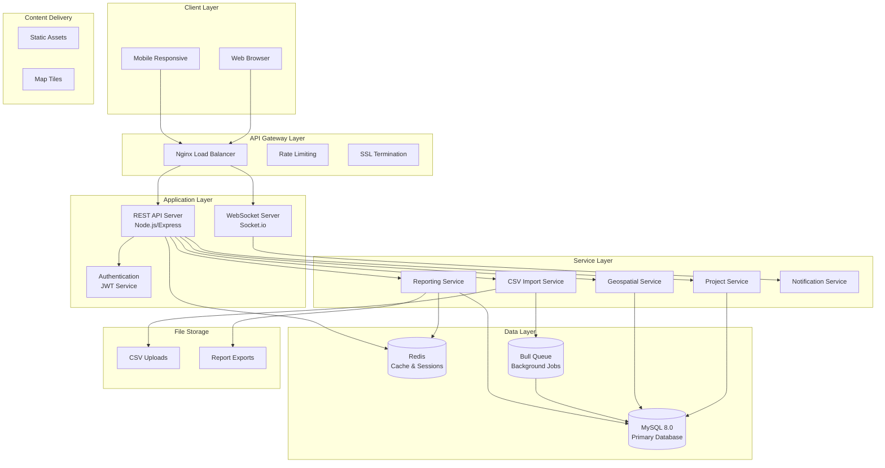
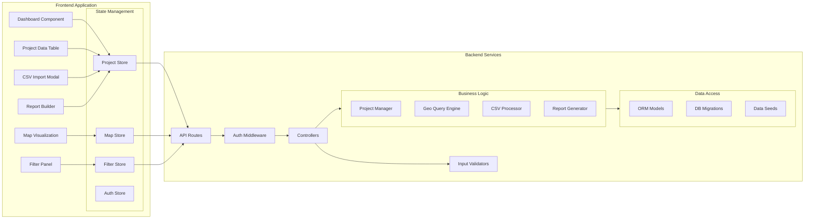
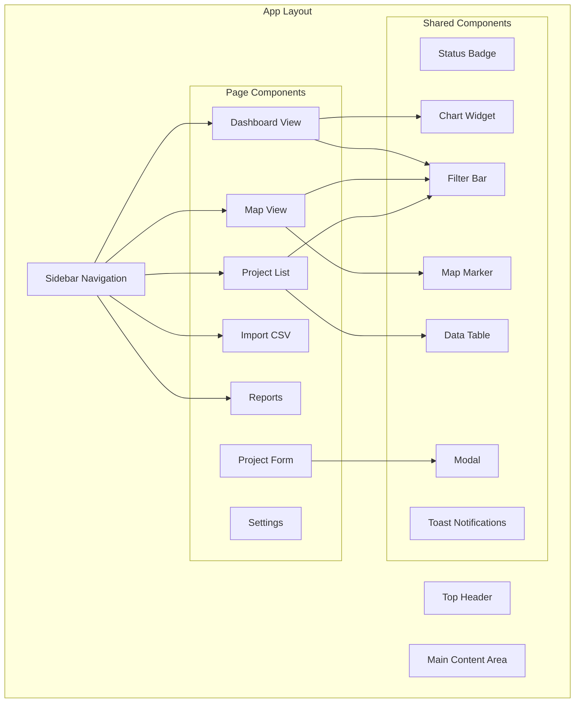
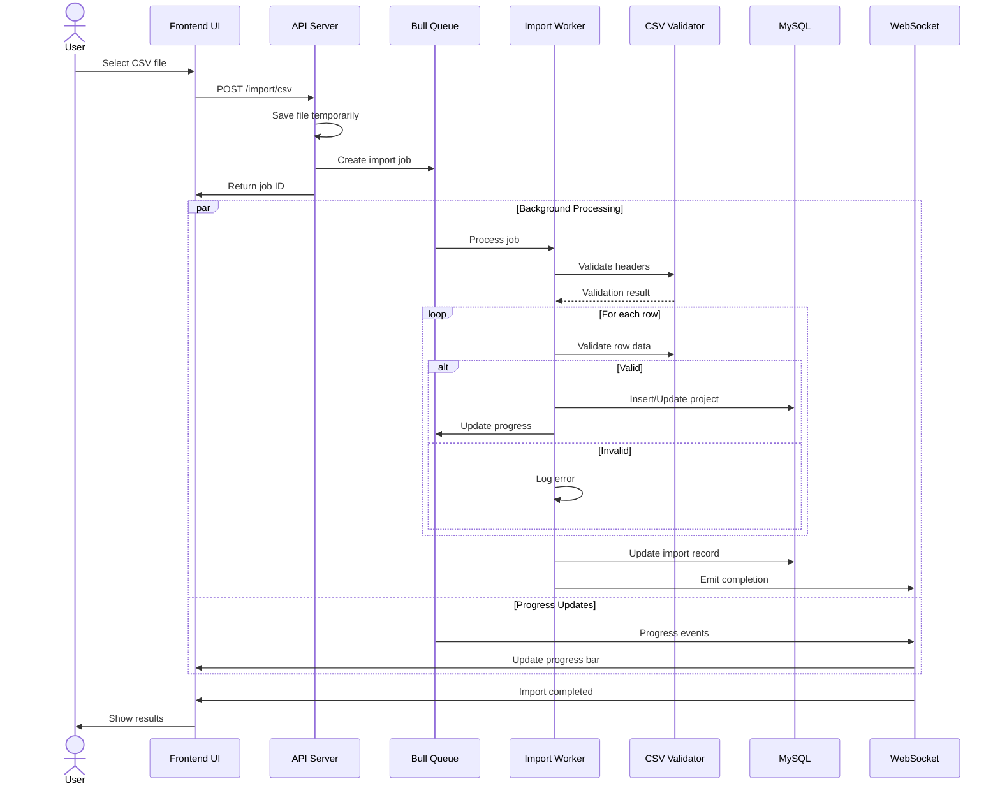
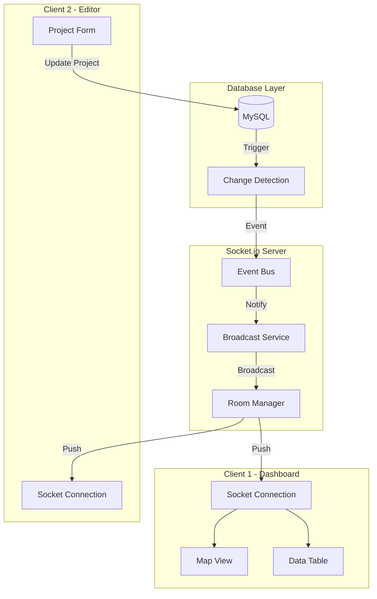
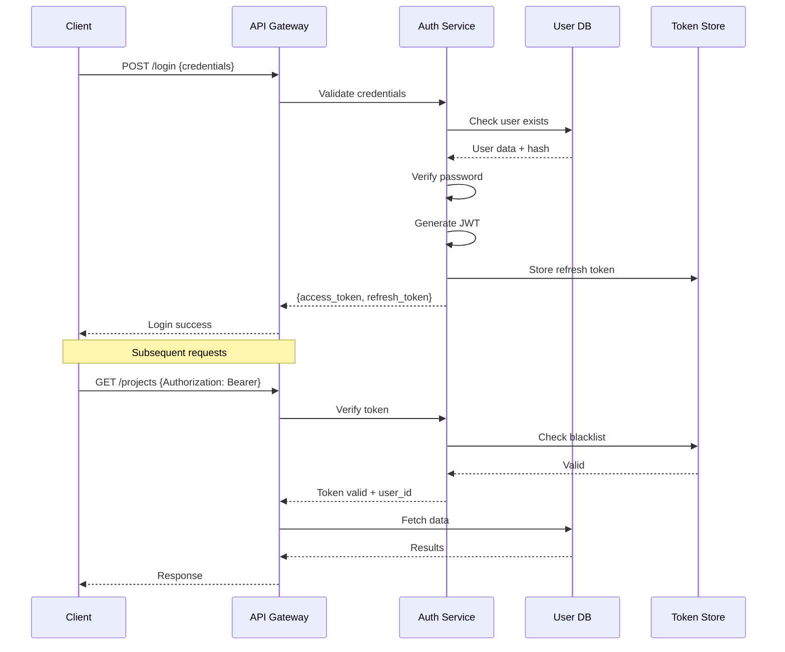

# Project Tracking Management System - Architecture Document

## Executive Summary

This document outlines the comprehensive architecture for a Project Tracking Management System featuring interactive geospatial visualization, MySQL backend, CSV import capabilities, and real-time dashboard updates.

---

## 1. Data Analysis & Domain Model

### 1.1 Source Data Structure (from database.xlsx)

| Field | Type | Description | Constraints |
|-------|------|-------------|-------------|
| Site Code | VARCHAR(20) | Unique identifier | PK, Pattern: [PREFIX]-[NUMBER][SUFFIX] |
| Project Name | VARCHAR(100) | Project category | FK to Projects table |
| Site Name | VARCHAR(150) | Specific location name | |
| Barangay | VARCHAR(100) | Smallest administrative unit | FK to Barangays |
| Municipality | VARCHAR(100) | City/Municipality | FK to Municipalities |
| Province | VARCHAR(100) | Province | FK to Provinces |
| District | VARCHAR(20) | Legislative district | |
| Latitude | DECIMAL(10,8) | Geographic coordinate | -90 to 90 |
| Longitude | DECIMAL(11,8) | Geographic coordinate | -180 to 180 |
| Date of Activation | DATE | Project start date | |
| Status | ENUM | Project status | Done, Pending, In Progress, Cancelled |

### 1.2 Identified Patterns
- **Site Codes** follow pattern: [ORG]-[TYPE]-[NUMBER][VARIANT]
  - Examples: UNDP-GI-0009A, CYBER-1231231, eLGU-1231231
- **Projects** are recurring categories: Free-WIFI for All, PNPKI/CYBER, IIDB, DigiGov-eLGU
- **Location Hierarchy**: Province → District → Municipality → Barangay
- **Geospatial Data**: Latitude/Longitude for map visualization

---

## 2. MySQL Database Schema Design

### 2.1 Entity Relationship Diagram

```mermaid
erDiagram
    PROVINCES ||--o{ MUNICIPALITIES : contains
    MUNICIPALITIES ||--o{ BARANGAYS : contains
    DISTRICTS ||--o{ MUNICIPALITIES : covers
    PROJECT_TYPES ||--o{ PROJECT_SITES : categorizes
    PROJECT_SITES ||--o{ PROJECT_STATUS_HISTORY : tracks
    USERS ||--o{ PROJECT_SITES : manages
    USERS ||--o{ AUDIT_LOGS : generates
    PROJECT_SITES ||--o{ AUDIT_LOGS : referenced_by
    
    PROVINCES {
        int id PK
        varchar name
        varchar region_code
        point centroid
        polygon boundary
        datetime created_at
        datetime updated_at
    }
    
    DISTRICTS {
        int id PK
        int province_id FK
        varchar name
        varchar district_code
        datetime created_at
    }
    
    MUNICIPALITIES {
        int id PK
        int province_id FK
        int district_id FK
        varchar name
        varchar municipality_code
        point centroid
        datetime created_at
    }
    
    BARANGAYS {
        int id PK
        int municipality_id FK
        varchar name
        varchar barangay_code
        point centroid
        datetime created_at
    }
    
    PROJECT_TYPES {
        int id PK
        varchar name
        varchar code_prefix
        text description
        varchar color_code
        boolean is_active
        datetime created_at
    }
    
    PROJECT_SITES {
        int id PK
        varchar site_code UK
        int project_type_id FK
        varchar site_name
        int barangay_id FK
        int municipality_id FK
        int province_id FK
        int district_id FK
        decimal latitude
        decimal longitude
        point location SPATIAL_INDEX
        date activation_date
        enum status
        text remarks
        int created_by FK
        int updated_by FK
        datetime created_at
        datetime updated_at
    }
    
    PROJECT_STATUS_HISTORY {
        int id PK
        int project_site_id FK
        enum old_status
        enum new_status
        text reason
        int changed_by FK
        datetime changed_at
    }
    
    USERS {
        int id PK
        varchar username UK
        varchar email UK
        varchar password_hash
        varchar full_name
        enum role
        boolean is_active
        datetime last_login
        datetime created_at
    }
    
    AUDIT_LOGS {
        int id PK
        int user_id FK
        varchar table_name
        int record_id
        enum action
        json old_values
        json new_values
        varchar ip_address
        datetime created_at
    }
    
    CSV_IMPORTS {
        int id PK
        varchar filename
        int total_rows
        int success_count
        int error_count
        json errors
        int imported_by FK
        enum status
        datetime started_at
        datetime completed_at
    }
```

### 2.2 SQL Schema Definition

```sql
-- Enable spatial extensions
SET GLOBAL innodb_file_per_table = 1;

-- ============================================
-- LOCATION HIERARCHY TABLES
-- ============================================

CREATE TABLE provinces (
    id INT AUTO_INCREMENT PRIMARY KEY,
    name VARCHAR(100) NOT NULL,
    region_code VARCHAR(10),
    centroid POINT SRID 4326,
    boundary POLYGON SRID 4326,
    created_at TIMESTAMP DEFAULT CURRENT_TIMESTAMP,
    updated_at TIMESTAMP DEFAULT CURRENT_TIMESTAMP ON UPDATE CURRENT_TIMESTAMP,
    INDEX idx_name (name),
    SPATIAL INDEX idx_centroid (centroid),
    SPATIAL INDEX idx_boundary (boundary)
) ENGINE=InnoDB DEFAULT CHARSET=utf8mb4 COLLATE=utf8mb4_unicode_ci;

CREATE TABLE districts (
    id INT AUTO_INCREMENT PRIMARY KEY,
    province_id INT NOT NULL,
    name VARCHAR(50) NOT NULL,
    district_code VARCHAR(20),
    created_at TIMESTAMP DEFAULT CURRENT_TIMESTAMP,
    FOREIGN KEY (province_id) REFERENCES provinces(id) ON DELETE CASCADE,
    INDEX idx_province (province_id),
    INDEX idx_name (name)
) ENGINE=InnoDB DEFAULT CHARSET=utf8mb4 COLLATE=utf8mb4_unicode_ci;

CREATE TABLE municipalities (
    id INT AUTO_INCREMENT PRIMARY KEY,
    province_id INT NOT NULL,
    district_id INT,
    name VARCHAR(100) NOT NULL,
    municipality_code VARCHAR(20),
    centroid POINT SRID 4326,
    created_at TIMESTAMP DEFAULT CURRENT_TIMESTAMP,
    FOREIGN KEY (province_id) REFERENCES provinces(id) ON DELETE CASCADE,
    FOREIGN KEY (district_id) REFERENCES districts(id) ON DELETE SET NULL,
    INDEX idx_province (province_id),
    INDEX idx_district (district_id),
    INDEX idx_name (name),
    SPATIAL INDEX idx_centroid (centroid)
) ENGINE=InnoDB DEFAULT CHARSET=utf8mb4 COLLATE=utf8mb4_unicode_ci;

CREATE TABLE barangays (
    id INT AUTO_INCREMENT PRIMARY KEY,
    municipality_id INT NOT NULL,
    name VARCHAR(100) NOT NULL,
    barangay_code VARCHAR(20),
    centroid POINT SRID 4326,
    created_at TIMESTAMP DEFAULT CURRENT_TIMESTAMP,
    FOREIGN KEY (municipality_id) REFERENCES municipalities(id) ON DELETE CASCADE,
    INDEX idx_municipality (municipality_id),
    INDEX idx_name (name),
    SPATIAL INDEX idx_centroid (centroid)
) ENGINE=InnoDB DEFAULT CHARSET=utf8mb4 COLLATE=utf8mb4_unicode_ci;

-- ============================================
-- PROJECT MANAGEMENT TABLES
-- ============================================

CREATE TABLE project_types (
    id INT AUTO_INCREMENT PRIMARY KEY,
    name VARCHAR(100) NOT NULL,
    code_prefix VARCHAR(20),
    description TEXT,
    color_code VARCHAR(7) DEFAULT '#007bff',
    icon_url VARCHAR(255),
    is_active BOOLEAN DEFAULT TRUE,
    created_at TIMESTAMP DEFAULT CURRENT_TIMESTAMP,
    updated_at TIMESTAMP DEFAULT CURRENT_TIMESTAMP ON UPDATE CURRENT_TIMESTAMP,
    UNIQUE KEY uk_name (name),
    INDEX idx_active (is_active)
) ENGINE=InnoDB DEFAULT CHARSET=utf8mb4 COLLATE=utf8mb4_unicode_ci;

CREATE TABLE project_sites (
    id INT AUTO_INCREMENT PRIMARY KEY,
    site_code VARCHAR(30) NOT NULL UNIQUE,
    project_type_id INT NOT NULL,
    site_name VARCHAR(150) NOT NULL,
    barangay_id INT,
    municipality_id INT NOT NULL,
    province_id INT NOT NULL,
    district_id INT,
    latitude DECIMAL(10, 8) NOT NULL,
    longitude DECIMAL(11, 8) NOT NULL,
    location POINT SRID 4326 NOT NULL,
    activation_date DATE,
    status ENUM('Pending', 'In Progress', 'Done', 'Cancelled', 'On Hold') DEFAULT 'Pending',
    remarks TEXT,
    metadata JSON,
    created_by INT,
    updated_by INT,
    created_at TIMESTAMP DEFAULT CURRENT_TIMESTAMP,
    updated_at TIMESTAMP DEFAULT CURRENT_TIMESTAMP ON UPDATE CURRENT_TIMESTAMP,
    FOREIGN KEY (project_type_id) REFERENCES project_types(id) ON DELETE RESTRICT,
    FOREIGN KEY (barangay_id) REFERENCES barangays(id) ON DELETE SET NULL,
    FOREIGN KEY (municipality_id) REFERENCES municipalities(id) ON DELETE RESTRICT,
    FOREIGN KEY (province_id) REFERENCES provinces(id) ON DELETE RESTRICT,
    FOREIGN KEY (district_id) REFERENCES districts(id) ON DELETE SET NULL,
    INDEX idx_site_code (site_code),
    INDEX idx_project_type (project_type_id),
    INDEX idx_status (status),
    INDEX idx_activation_date (activation_date),
    INDEX idx_location_lookup (province_id, municipality_id, barangay_id),
    SPATIAL INDEX idx_location (location)
) ENGINE=InnoDB DEFAULT CHARSET=utf8mb4 COLLATE=utf8mb4_unicode_ci;

-- ============================================
-- AUDIT & HISTORY TABLES
-- ============================================

CREATE TABLE project_status_history (
    id INT AUTO_INCREMENT PRIMARY KEY,
    project_site_id INT NOT NULL,
    old_status ENUM('Pending', 'In Progress', 'Done', 'Cancelled', 'On Hold'),
    new_status ENUM('Pending', 'In Progress', 'Done', 'Cancelled', 'On Hold') NOT NULL,
    reason TEXT,
    changed_by INT,
    changed_at TIMESTAMP DEFAULT CURRENT_TIMESTAMP,
    FOREIGN KEY (project_site_id) REFERENCES project_sites(id) ON DELETE CASCADE,
    INDEX idx_project (project_site_id),
    INDEX idx_changed_at (changed_at)
) ENGINE=InnoDB DEFAULT CHARSET=utf8mb4 COLLATE=utf8mb4_unicode_ci;

CREATE TABLE users (
    id INT AUTO_INCREMENT PRIMARY KEY,
    username VARCHAR(50) NOT NULL UNIQUE,
    email VARCHAR(100) NOT NULL UNIQUE,
    password_hash VARCHAR(255) NOT NULL,
    full_name VARCHAR(100) NOT NULL,
    role ENUM('Admin', 'Manager', 'Editor', 'Viewer') DEFAULT 'Viewer',
    is_active BOOLEAN DEFAULT TRUE,
    last_login TIMESTAMP NULL,
    created_at TIMESTAMP DEFAULT CURRENT_TIMESTAMP,
    updated_at TIMESTAMP DEFAULT CURRENT_TIMESTAMP ON UPDATE CURRENT_TIMESTAMP,
    INDEX idx_role (role),
    INDEX idx_active (is_active)
) ENGINE=InnoDB DEFAULT CHARSET=utf8mb4 COLLATE=utf8mb4_unicode_ci;

CREATE TABLE audit_logs (
    id BIGINT AUTO_INCREMENT PRIMARY KEY,
    user_id INT,
    table_name VARCHAR(50) NOT NULL,
    record_id INT NOT NULL,
    action ENUM('CREATE', 'UPDATE', 'DELETE', 'IMPORT', 'EXPORT') NOT NULL,
    old_values JSON,
    new_values JSON,
    ip_address VARCHAR(45),
    user_agent VARCHAR(255),
    created_at TIMESTAMP DEFAULT CURRENT_TIMESTAMP,
    INDEX idx_table_record (table_name, record_id),
    INDEX idx_user (user_id),
    INDEX idx_created_at (created_at)
) ENGINE=InnoDB DEFAULT CHARSET=utf8mb4 COLLATE=utf8mb4_unicode_ci;

-- ============================================
-- CSV IMPORT TRACKING
-- ============================================

CREATE TABLE csv_imports (
    id INT AUTO_INCREMENT PRIMARY KEY,
    filename VARCHAR(255) NOT NULL,
    original_filename VARCHAR(255),
    total_rows INT DEFAULT 0,
    success_count INT DEFAULT 0,
    error_count INT DEFAULT 0,
    errors JSON,
    imported_by INT,
    status ENUM('Pending', 'Processing', 'Completed', 'Failed', 'Partial') DEFAULT 'Pending',
    started_at TIMESTAMP NULL,
    completed_at TIMESTAMP NULL,
    created_at TIMESTAMP DEFAULT CURRENT_TIMESTAMP,
    FOREIGN KEY (imported_by) REFERENCES users(id) ON DELETE SET NULL,
    INDEX idx_status (status),
    INDEX idx_imported_by (imported_by)
) ENGINE=InnoDB DEFAULT CHARSET=utf8mb4 COLLATE=utf8mb4_unicode_ci;

-- ============================================
-- VIEWS FOR REPORTING
-- ============================================

CREATE VIEW project_summary_view AS
SELECT 
    ps.id,
    ps.site_code,
    ps.site_name,
    pt.name AS project_type,
    pt.color_code,
    ps.status,
    ps.activation_date,
    ps.latitude,
    ps.longitude,
    b.name AS barangay,
    m.name AS municipality,
    p.name AS province,
    d.name AS district,
    ps.created_at,
    ps.updated_at,
    CONCAT(u.full_name) AS last_updated_by
FROM project_sites ps
JOIN project_types pt ON ps.project_type_id = pt.id
LEFT JOIN barangays b ON ps.barangay_id = b.id
JOIN municipalities m ON ps.municipality_id = m.id
JOIN provinces p ON ps.province_id = p.id
LEFT JOIN districts d ON ps.district_id = d.id
LEFT JOIN users u ON ps.updated_by = u.id;

-- ============================================
-- TRIGGERS FOR AUDIT LOGGING
-- ============================================

DELIMITER //

CREATE TRIGGER trg_project_sites_insert
AFTER INSERT ON project_sites
FOR EACH ROW
BEGIN
    INSERT INTO audit_logs (user_id, table_name, record_id, action, new_values, created_at)
    VALUES (@current_user_id, 'project_sites', NEW.id, 'CREATE', JSON_OBJECT(
        'site_code', NEW.site_code,
        'site_name', NEW.site_name,
        'status', NEW.status,
        'latitude', NEW.latitude,
        'longitude', NEW.longitude
    ), NOW());
END//

CREATE TRIGGER trg_project_sites_update
AFTER UPDATE ON project_sites
FOR EACH ROW
BEGIN
    -- Log status change to history if status changed
    IF OLD.status != NEW.status THEN
        INSERT INTO project_status_history (project_site_id, old_status, new_status, changed_by, changed_at)
        VALUES (NEW.id, OLD.status, NEW.status, @current_user_id, NOW());
    END IF;
    
    -- Log to audit
    INSERT INTO audit_logs (user_id, table_name, record_id, action, old_values, new_values, created_at)
    VALUES (@current_user_id, 'project_sites', NEW.id, 'UPDATE', JSON_OBJECT(
        'site_code', OLD.site_code,
        'site_name', OLD.site_name,
        'status', OLD.status
    ), JSON_OBJECT(
        'site_code', NEW.site_code,
        'site_name', NEW.site_name,
        'status', NEW.status
    ), NOW());
END//

CREATE TRIGGER trg_project_sites_delete
BEFORE DELETE ON project_sites
FOR EACH ROW
BEGIN
    INSERT INTO audit_logs (user_id, table_name, record_id, action, old_values, created_at)
    VALUES (@current_user_id, 'project_sites', OLD.id, 'DELETE', JSON_OBJECT(
        'site_code', OLD.site_code,
        'site_name', OLD.site_name,
        'status', OLD.status
    ), NOW());
END//

DELIMITER ;
```

### 2.3 Spatial Query Examples

```sql
-- Find projects within radius (e.g., 10km from a point)
SELECT 
    site_code,
    site_name,
    ST_Distance_Sphere(location, ST_GeomFromText('POINT(121.804235 20.728794)', 4326)) / 1000 AS distance_km
FROM project_sites
WHERE ST_Distance_Sphere(location, ST_GeomFromText('POINT(121.804235 20.728794)', 4326)) <= 10000
ORDER BY distance_km;

-- Find projects within a bounding box (map viewport)
SELECT * FROM project_sites
WHERE MBRContains(
    ST_GeomFromText('Polygon((121.0 20.0, 122.0 20.0, 122.0 21.0, 121.0 21.0, 121.0 20.0))'),
    location
);

-- Cluster projects by proximity for heatmap
SELECT 
    ROUND(latitude, 2) as lat_grid,
    ROUND(longitude, 2) as lng_grid,
    COUNT(*) as project_count,
    GROUP_CONCAT(site_code) as sites
FROM project_sites
WHERE status = 'Done'
GROUP BY lat_grid, lng_grid;
```

---

## 3. Technology Stack Recommendations

### 3.1 Recommended Stack

| Layer | Technology | Rationale |
|-------|-----------|-----------|
| **Frontend Framework** | React 18+ with TypeScript | Component-based, excellent ecosystem, type safety |
| **Mapping Library** | Leaflet + React-Leaflet | Lightweight, MySQL compatible, customizable markers |
| **State Management** | Zustand + React Query | Lightweight, excellent for server state |
| **UI Components** | shadcn/ui + Tailwind CSS | Modern, accessible, customizable |
| **Charts/Reports** | Recharts + Apache ECharts | Comprehensive visualization options |
| **Backend Framework** | Node.js + Express/Fastify | Fast, scalable, excellent MySQL drivers |
| **ORM** | Prisma or TypeORM | Type-safe database access, migration support |
| **Real-time** | Socket.io | WebSocket support for live updates |
| **Authentication** | JWT + bcrypt | Stateless, scalable auth |
| **File Processing** | Multer + csv-parser | Stream-based CSV processing |
| **Caching** | Redis | Session storage, query caching |
| **Queue** | Bull/Agenda | Background job processing for imports |

### 3.2 Alternative Stack Options

| Layer | Alternative | Use Case |
|-------|-------------|----------|
| Frontend | Vue 3 + Composition API | Simpler learning curve |
| Mapping | MapLibre GL | Vector tiles, 3D support |
| Backend | Python + FastAPI | Data science integration |
| Backend | PHP + Laravel | Existing WAMP expertise |

---

## 4. System Architecture

### 4.1 High-Level Architecture Diagram



### 4.2 Component Architecture



---

## 5. API Design

### 5.1 REST API Endpoints

```yaml
# Authentication
POST   /api/v1/auth/login
POST   /api/v1/auth/logout
POST   /api/v1/auth/refresh
GET    /api/v1/auth/me

# Projects
GET    /api/v1/projects              # List with filters
POST   /api/v1/projects              # Create new
GET    /api/v1/projects/:id          # Get single
PUT    /api/v1/projects/:id          # Update
DELETE /api/v1/projects/:id          # Delete
GET    /api/v1/projects/:id/history  # Status history

# Geospatial
GET    /api/v1/projects/map-data     # Get geojson for map
GET    /api/v1/projects/nearby       # Find nearby projects
POST   /api/v1/projects/bounding-box # Projects in viewport

# Import/Export
POST   /api/v1/import/csv            # Upload CSV
GET    /api/v1/import/:id/status     # Check import status
GET    /api/v1/export/csv            # Export to CSV
GET    /api/v1/export/pdf            # Generate report PDF

# Reports
GET    /api/v1/reports/summary       # Dashboard stats
GET    /api/v1/reports/by-status     # Status breakdown
GET    /api/v1/reports/by-location   # Location breakdown
GET    /api/v1/reports/timeline      # Progress timeline

# Reference Data
GET    /api/v1/provinces
GET    /api/v1/municipalities
GET    /api/v1/barangays
GET    /api/v1/project-types
```

### 5.2 WebSocket Events

```yaml
# Client -> Server
subscribe:projects          # Subscribe to project updates
subscribe:imports:{id}      # Subscribe to import progress

# Server -> Client
project:created             # New project added
project:updated             # Project modified
project:deleted             # Project removed
import:progress             # Import percentage complete
import:completed            # Import finished
notification:new            # System notification
```

---

## 6. Frontend Dashboard Architecture

### 6.1 Dashboard Layout Structure



### 6.2 Map Visualization Component

```typescript
// Key interfaces for map implementation
interface MapConfig {
  center: [number, number];      // [lat, lng]
  zoom: number;
  maxBounds?: [[number, number], [number, number]];
}

interface ProjectMarker {
  id: number;
  siteCode: string;
  position: [number, number];
  projectType: string;
  status: ProjectStatus;
  color: string;
  popupData: ProjectPopupData;
}

interface MapFilters {
  projectTypes: number[];
  statuses: ProjectStatus[];
  provinces: number[];
  dateRange: { start: Date; end: Date };
  boundingBox?: BoundingBox;
}

interface BoundingBox {
  north: number;
  south: number;
  east: number;
  west: number;
}
```

---

## 7. CSV Import Module Architecture

### 7.1 Import Process Flow



### 7.2 CSV Schema Mapping

```typescript
interface CSVColumnMapping {
  siteCode: string;           // Site Code
  projectName: string;        // Project Name
  siteName: string;           // Site Name
  barangay: string;           // Barangay
  municipality: string;       // Municipality
  province: string;           // Province
  district: string;           // District
  latitude: string;           // Latitude
  longitude: string;          // Longitude
  activationDate: string;     // Date of Activation
  status: string;             // Status
}

interface ImportValidationRules {
  siteCode: { required: true, pattern: /^[A-Z]+-[A-Z]+-\d+[A-Z]?$/ };
  latitude: { required: true, min: -90, max: 90 };
  longitude: { required: true, min: -180, max: 180 };
  activationDate: { required: true, format: 'YYYY-MM-DD' };
  status: { required: true, enum: ['Pending', 'In Progress', 'Done', 'Cancelled'] };
}
```

### 7.3 Error Handling Strategy

| Error Type | Handling | User Feedback |
|------------|----------|---------------|
| Invalid Headers | Reject entire file | Show expected vs actual headers |
| Row Validation Fail | Skip row, log error | Show row number and reason |
| Duplicate Site Code | Update or Skip based on setting | Confirmation dialog |
| Missing Location | Geocode if possible or flag | Warning with geocoding option |
| DB Connection Error | Retry 3x then fail | Toast notification |

---

## 8. Real-time Updates Architecture

### 8.1 WebSocket Implementation



---

## 9. Security Architecture

### 9.1 Authentication Flow



### 9.2 Security Measures

| Layer | Security Measure | Implementation |
|-------|-----------------|----------------|
| Transport | HTTPS/TLS 1.3 | Nginx SSL config |
| Authentication | JWT with refresh tokens | 15min access, 7day refresh |
| Authorization | RBAC | Admin/Manager/Editor/Viewer roles |
| Input | Validation + Sanitization | Joi/Zod schemas |
| SQL | Parameterized queries | ORM prepared statements |
| XSS | Output encoding | React auto-escape |
| CSRF | Token validation | Double-submit cookie |
| Files | Type + size validation | Multer filters |
| Rate Limit | API throttling | express-rate-limit |

---

## 10. Implementation Roadmap

### Phase 1: Foundation (Weeks 1-2)
- [ ] Set up development environment
- [ ] Create MySQL schema and migrations
- [ ] Seed reference data (provinces, municipalities)
- [ ] Set up Express API server
- [ ] Implement authentication system

### Phase 2: Core Features (Weeks 3-4)
- [ ] CRUD operations for projects
- [ ] Basic map visualization with Leaflet
- [ ] Project list with filtering
- [ ] Dashboard statistics

### Phase 3: Geospatial & Import (Weeks 5-6)
- [ ] MySQL spatial queries implementation
- [ ] Advanced map features (clusters, heatmaps)
- [ ] CSV import module
- [ ] Data validation and geocoding

### Phase 4: Reporting & Polish (Weeks 7-8)
- [ ] Report builder
- [ ] PDF/Excel export
- [ ] Real-time updates with WebSockets
- [ ] UI/UX refinements

### Phase 5: Production (Week 9)
- [ ] Performance optimization
- [ ] Security audit
- [ ] Deployment setup
- [ ] Documentation

---

## 11. Folder Structure

```
project-management-system/
├── backend/
│   ├── src/
│   │   ├── config/
│   │   │   ├── database.ts
│   │   │   ├── redis.ts
│   │   │   └── socket.ts
│   │   ├── controllers/
│   │   │   ├── auth.controller.ts
│   │   │   ├── project.controller.ts
│   │   │   ├── import.controller.ts
│   │   │   └── report.controller.ts
│   │   ├── services/
│   │   │   ├── project.service.ts
│   │   │   ├── geo.service.ts
│   │   │   ├── csv-import.service.ts
│   │   │   └── report.service.ts
│   │   ├── models/
│   │   │   ├── user.model.ts
│   │   │   ├── project.model.ts
│   │   │   └── location.model.ts
│   │   ├── middleware/
│   │   │   ├── auth.middleware.ts
│   │   │   ├── validation.middleware.ts
│   │   │   └── error.middleware.ts
│   │   ├── routes/
│   │   │   ├── index.ts
│   │   │   ├── auth.routes.ts
│   │   │   ├── project.routes.ts
│   │   │   └── import.routes.ts
│   │   ├── utils/
│   │   │   ├── validators.ts
│   │   │   ├── geocoding.ts
│   │   │   └── logger.ts
│   │   └── jobs/
│   │       └── csv-import.job.ts
│   ├── prisma/
│   │   └── schema.prisma
│   ├── uploads/
│   └── tests/
├── frontend/
│   ├── src/
│   │   ├── components/
│   │   │   ├── map/
│   │   │   │   ├── ProjectMap.tsx
│   │   │   │   ├── MapMarker.tsx
│   │   │   │   └── MapControls.tsx
│   │   │   ├── projects/
│   │   │   │   ├── ProjectTable.tsx
│   │   │   │   ├── ProjectForm.tsx
│   │   │   │   └── ProjectFilters.tsx
│   │   │   ├── dashboard/
│   │   │   │   ├── StatsCards.tsx
│   │   │   │   ├── StatusChart.tsx
│   │   │   │   └── RecentActivity.tsx
│   │   │   └── import/
│   │   │       ├── CSVUploader.tsx
│   │   │       └── ImportProgress.tsx
│   │   ├── hooks/
│   │   │   ├── useProjects.ts
│   │   │   ├── useMapData.ts
│   │   │   └── useSocket.ts
│   │   ├── stores/
│   │   │   ├── projectStore.ts
│   │   │   ├── filterStore.ts
│   │   │   └── authStore.ts
│   │   ├── services/
│   │   │   ├── api.ts
│   │   │   ├── project.service.ts
│   │   │   └── socket.service.ts
│   │   ├── types/
│   │   │   └── index.ts
│   │   └── App.tsx
│   └── public/
├── database/
│   ├── migrations/
│   ├── seeds/
│   └── sample-data/
├── docs/
└── docker-compose.yml
```

---

## 12. Performance Considerations

### 12.1 Database Optimization
- Spatial indexes on location columns
- Composite indexes for common query patterns
- Query result caching with Redis
- Connection pooling (default 10 connections)

### 12.2 Frontend Optimization
- Virtual scrolling for large datasets
- Map marker clustering (>100 markers)
- Lazy loading for report components
- Debounced filter inputs

### 12.3 API Optimization
- Pagination (default 50 items/page)
- Field selection (sparse fieldsets)
- Compression (gzip/brotli)
- CDN for static assets

---

## 13. Scalability Plan

| Metric | Current | Scale Target | Strategy |
|--------|---------|--------------|----------|
| Projects | 1,000 | 100,000 | Sharding by region |
| Concurrent Users | 50 | 1,000 | Horizontal scaling |
| Import Size | 10MB | 100MB | Chunked processing |
| Map Markers | 500 | 10,000 | Viewport-based loading |
| Reports | Simple | Complex | Dedicated report DB |

---

## Appendix A: Sample Data Migration Script

```sql
-- Seed sample data from spreadsheet
INSERT INTO provinces (name, region_code, centroid) VALUES
('Batanes', '02', ST_GeomFromText('POINT(121.875 20.75)', 4326)),
('Cagayan', '02', ST_GeomFromText('POINT(121.75 17.75)', 4326));

INSERT INTO districts (province_id, name, district_code) VALUES
(1, 'District I', 'BTN-D1'),
(2, 'District III', 'CAG-D3');

INSERT INTO municipalities (province_id, district_id, name, municipality_code) VALUES
(1, 1, 'Itbayat', 'BTN-ITB'),
(1, 1, 'Ivana', 'BTN-IVN'),
(2, 2, 'Iguig', 'CAG-IGG');

INSERT INTO barangays (municipality_id, name, barangay_code) VALUES
(1, 'Raele', 'BTN-ITB-RLE'),
(1, 'Santa Lucia', 'BTN-ITB-SLU'),
(1, 'Santa Maria', 'BTN-ITB-SMA'),
(2, 'Salagao', 'BTN-IVN-SLG'),
(3, 'Ajat', 'CAG-IGG-AJT');

INSERT INTO project_types (name, code_prefix, color_code) VALUES
('Free-WIFI for All', 'UNDP', '#28a745'),
('PNPKI/CYBER', 'CYBER', '#dc3545'),
('IIDB', 'IIDB', '#007bff'),
('DigiGov-eLGU', 'eLGU', '#ffc107');
```

---

## Appendix B: Environment Configuration

```env
# Database
DB_HOST=localhost
DB_PORT=3306
DB_NAME=project_tracking
DB_USER=root
DB_PASSWORD=
DB_POOL_SIZE=10

# Redis
REDIS_URL=redis://localhost:6379

# JWT
JWT_SECRET=your-secret-key
JWT_EXPIRES_IN=15m
JWT_REFRESH_EXPIRES_IN=7d

# File Upload
UPLOAD_MAX_SIZE=10485760
UPLOAD_DIR=./uploads

# Map
MAP_TILE_URL=https://{s}.tile.openstreetmap.org/{z}/{x}/{y}.png
MAP_DEFAULT_CENTER=14.5995,120.9842
MAP_DEFAULT_ZOOM=6

# WebSocket
WS_CORS_ORIGIN=http://localhost:3000
```
